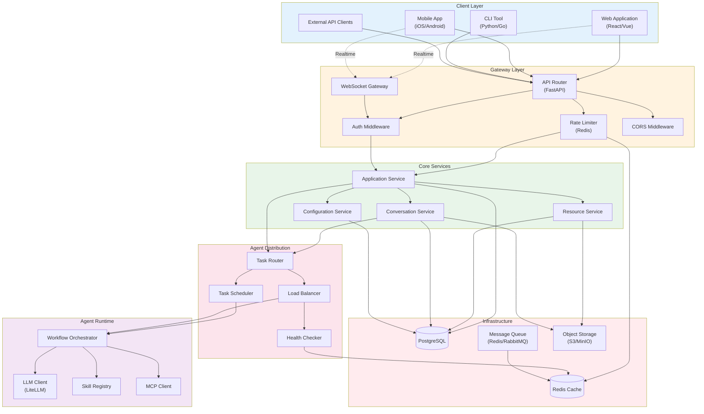
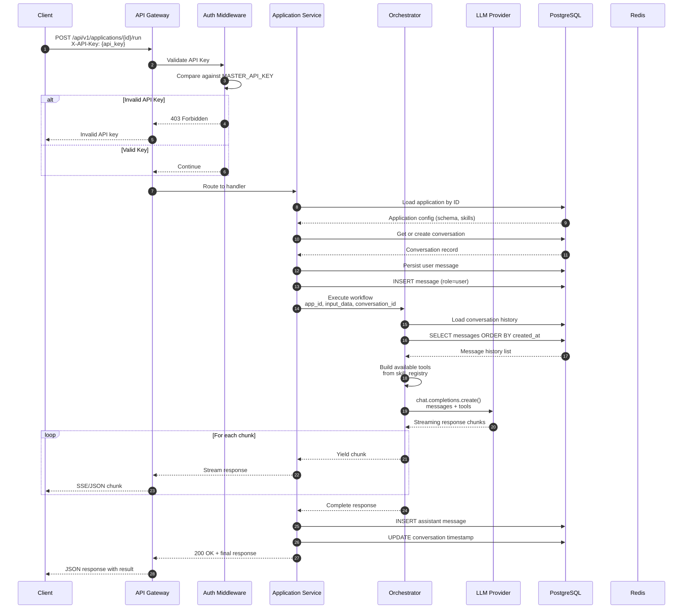
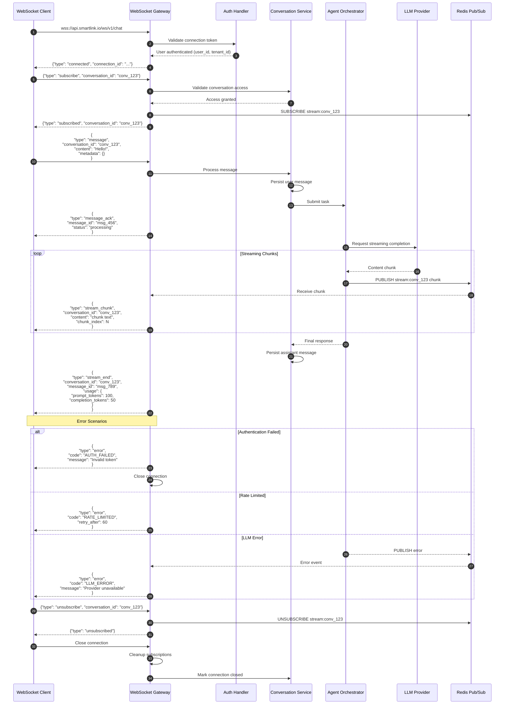
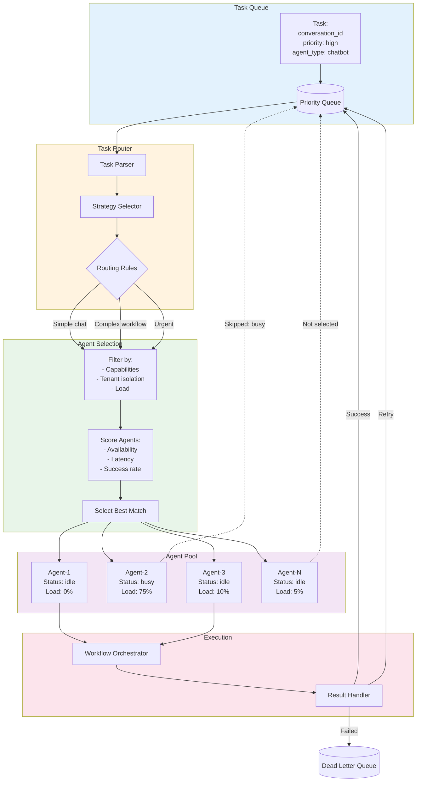
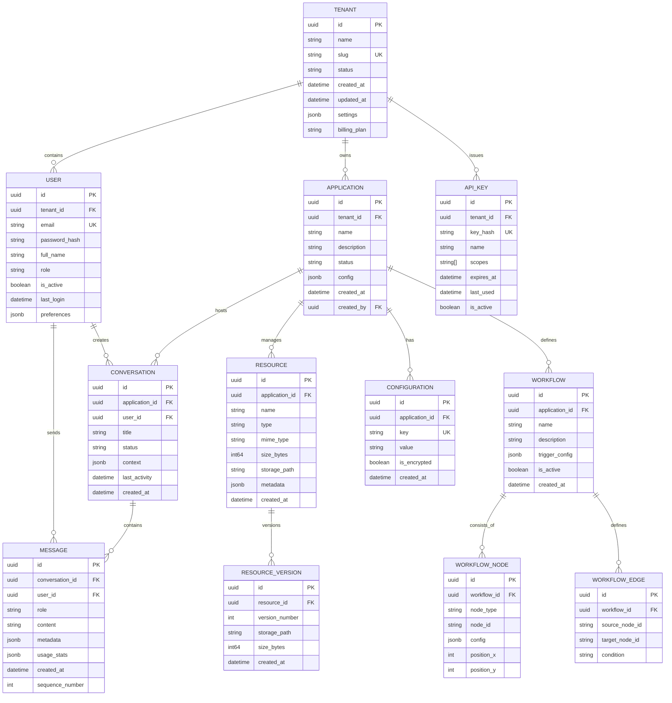
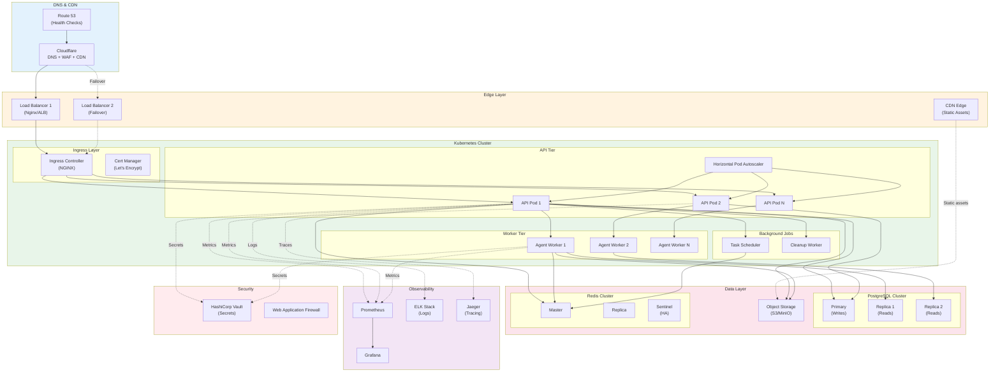
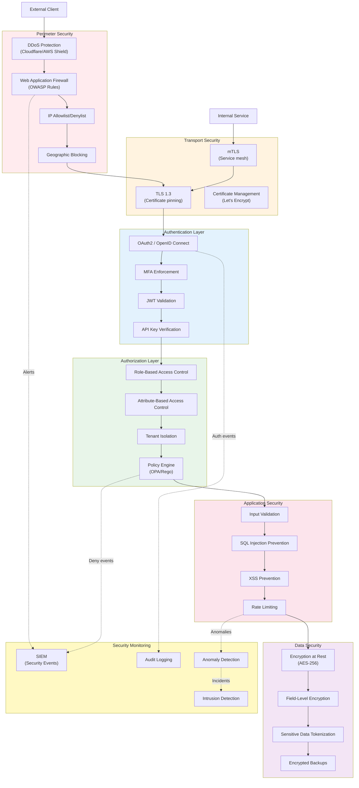
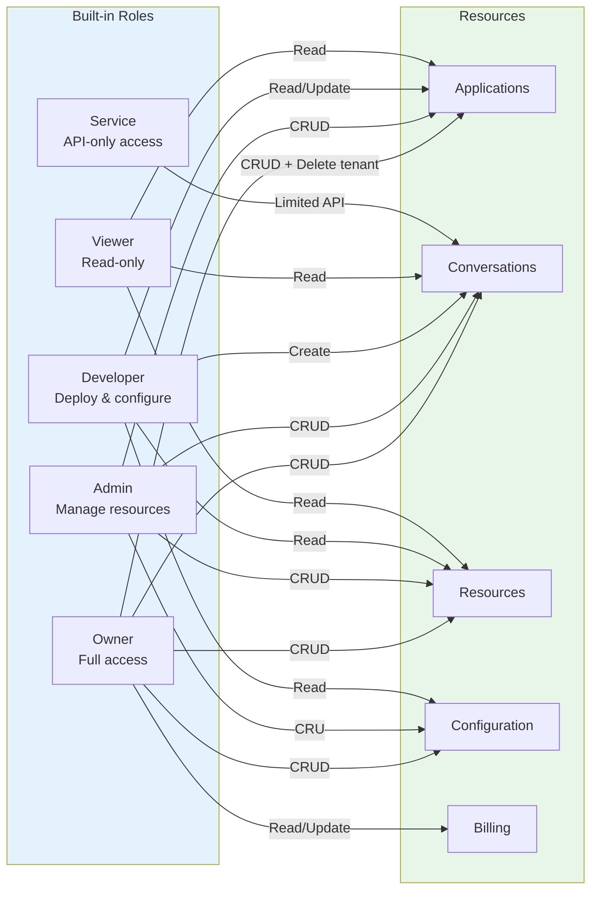

# Architecture Diagrams

This document contains visual representations of the SmartLink platform architecture using Mermaid diagrams.

## Table of Contents

1. [System Architecture](#1-system-architecture)
2. [Data Flow Diagram](#2-data-flow-diagram)
3. [Authentication Flow](#3-authentication-flow)
4. [WebSocket Protocol](#4-websocket-protocol)
5. [Agent Distribution Flow](#5-agent-distribution-flow)
6. [Multi-Tenant Data Model](#6-multi-tenant-data-model)
7. [Deployment Topology](#7-deployment-topology)
8. [Security Architecture](#8-security-architecture)

---

## 1. System Architecture

High-level component view showing the layered architecture and major subsystems.



### Component Descriptions

| Layer | Component | Purpose |
|-------|-----------|---------|
| Client | WebApp, MobileApp, CLI | User-facing applications and tools |
| Gateway | APIRouter, WSGateway | Entry points with routing and protocol handling |
| Core | Application, Resource, Conversation Services | Business logic and domain operations |
| Distribution | Router, Load Balancer | Task allocation and agent selection |
| Runtime | Orchestrator, LLM Client | AI agent execution and LLM integration |
| Infrastructure | Database, Cache, Storage | Persistent and ephemeral data stores |

---

## 2. Data Flow Diagram

Request and response flow through the system, showing how a typical API call is processed.



### Flow Stages

1. **Ingress**: Client sends request with X-API-Key header
2. **Authentication**: API key validated against MASTER_API_KEY
3. **Routing**: Request routed to Application Service handler
4. **Validation**: Application loaded and validated
5. **Persistence**: User message stored in database
6. **Execution**: Orchestrator processes with conversation context
7. **LLM Call**: LiteLLM routes to configured provider
8. **Streaming**: Response chunks returned via streaming
9. **Persistence**: Assistant response stored
10. **Response**: Final result returned to client

---

## 3. Authentication Flow

API Key-based authentication flow. Currently implements master API key validation with support for per-key permissions.

```mermaid
flowchart LR
    subgraph Client["Client Application"]
        User["User/Developer"]
        App["App Client"]
    end

    subgraph Gateway["API Gateway"]
        APIGW["FastAPI Gateway"]
        AuthMW["API Key Middleware<br/>gateway/middleware/auth.py"]
        CorsMW["CORS Middleware"]
    end

    subgraph Validation["Key Validation"]
        CheckHeader["Extract X-API-Key Header"]
        VerifyKey["verify_api_key()<br/>core/security.py"]
        CheckPublic{"Public Path?"}
    end

    subgraph Storage["Storage"]
        MasterKey[(Master Key<br/>env: MASTER_API_KEY)]
        APIKeyDB[(API Key Table<br/>models/application.py)]
    end

    subgraph Backend["Backend Services"]
        AppSvc["Application Service"]
        ResourceSvc["Resource Service"]
    end

    %% API Key Flow
    User -->|"1. Generate API Key"| App
    App -->|"2. Request with X-API-Key"| APIGW
    APIGW -->|"3. Check path"| CheckPublic
    CheckPublic -->|"Public<br/>/, /health, /docs"| CorsMW
    CheckPublic -->|"Protected"| AuthMW
    
    AuthMW -->|"4. Extract header"| CheckHeader
    CheckHeader -->|"5. Validate"| VerifyKey
    
    VerifyKey -->|"6a. Check master key"| MasterKey
    VerifyKey -->|"6b. Check database"| APIKeyDB
    
    MasterKey -->|"7a. Valid"| CorsMW
    APIKeyDB -->|"7b. Valid + permissions"| CorsMW
    
    CorsMW -->|"8. Route to handler"| AppSvc
    AppSvc -->|"9. CRUD Operations"| ResourceSvc
    
    %% WebSocket Flow
    App -.->|"WS: api_key query param"| APIGW
    APIGW -.->|"verify_api_key_ws()"| VerifyKey

    style Client fill:#e3f2fd
    style Gateway fill:#fff3e0
    style Validation fill:#e8f5e9
    style Storage fill:#ffebee
    style Backend fill:#fce4ec
```



### Authentication Methods

| Method | Use Case | Location | Implementation |
|--------|----------|----------|----------------|
| Master API Key | Development, admin access | Environment variable | `MASTER_API_KEY` in `.env` |
| Database API Key | Per-application keys | PostgreSQL | `APIKey` model |
| WebSocket Key | Real-time connections | Query param or header | `verify_api_key_ws()` |

### Public Paths (No Auth Required)

```python
PUBLIC_PATHS = {
    "/",           # Root
    "/health",     # Health check
    "/docs",       # Swagger UI
    "/redoc",      # ReDoc
    "/openapi.json",
    "/metrics",
    "/ws*",        # WebSocket (auth handled separately)
    "/static*"
}
```

### API Key Header

```http
GET /api/v1/applications HTTP/1.1
Host: localhost:8000
X-API-Key: sk-smartlink-master-key-change-in-production
```

### Future Enhancements

| Feature | Status | Planned For |
|---------|--------|-------------|
| OAuth2 / OpenID Connect | Not implemented | v2.0 |
| JWT Tokens | Not implemented | v2.0 |
| Role-Based Access Control | Partial | v1.5 |
| API Key expiration | Partial | v1.2 |
| Token refresh | Not implemented | v2.0 |

---

## 4. WebSocket Protocol

Real-time bidirectional communication protocol for streaming responses.



### Message Types

| Type | Direction | Description |
|------|-----------|-------------|
| `connected` | Server->Client | Connection established |
| `subscribe` | Client->Server | Subscribe to conversation stream |
| `subscribed` | Server->Client | Subscription confirmed |
| `message` | Client->Server | Send chat message |
| `message_ack` | Server->Client | Message received acknowledgment |
| `stream_chunk` | Server->Client | Partial LLM response |
| `stream_end` | Server->Client | Streaming complete |
| `error` | Server->Client | Error notification |
| `ping/pong` | Bidirectional | Keep-alive heartbeat |
| `unsubscribe` | Client->Server | Stop receiving updates |

### Connection Lifecycle

1. **Connect**: WebSocket handshake with JWT in query param or header
2. **Subscribe**: Join conversation-specific channels
3. **Interact**: Send messages, receive streaming responses
4. **Disconnect**: Graceful close or timeout cleanup

---

## 5. Agent Distribution Flow

Task routing and agent selection for distributed execution.



### Routing Strategies

| Strategy | Description | Use Case |
|----------|-------------|----------|
| **Round Robin** | Distribute evenly across agents | General load balancing |
| **Least Loaded** | Route to agent with lowest CPU/memory | CPU-intensive tasks |
| **Capability Match** | Match task requirements to agent skills | Specialized workflows |
| **Tenant Affinity** | Prefer agents already handling tenant's data | Data locality |
| **Geographic** | Route to nearest agent | Latency-sensitive tasks |
| **Priority** | High-priority tasks jump queue | Urgent requests |

### Agent Selection Algorithm

```python
score = (
    availability_weight * (1 - agent.current_load) +
    latency_weight * (1 / agent.average_latency) +
    success_weight * agent.success_rate +
    affinity_weight * (1 if agent.tenant == task.tenant else 0) +
    capability_weight * agent.capability_match(task.requirements)
)
```

### Failure Handling

1. **Retry**: Up to 3 attempts with exponential backoff
2. **Circuit Breaker**: Temporarily disable failing agents
3. **Dead Letter Queue**: Persist failed tasks for analysis
4. **Failover**: Automatic agent replacement

---

## 6. Multi-Tenant Data Model

Entity relationships for tenant-isolated data architecture.



### Tenant Isolation Strategy

| Level | Implementation | Description |
|-------|---------------|-------------|
| **Database** | Schema per tenant | Separate schemas for strict isolation |
| **Row-Level** | tenant_id column | Single schema with tenant filtering |
| **Application** | Middleware filtering | Query filtering in service layer |

### Key Relationships

1. **Tenant -> Users**: One-to-many, users belong to exactly one tenant
2. **Tenant -> Applications**: One-to-many, applications are tenant-scoped
3. **Application -> Conversations**: One-to-many, conversations belong to one app
4. **Conversation -> Messages**: One-to-many, ordered by sequence_number
5. **User -> Conversations**: One-to-many, track conversation ownership
6. **Application -> Resources**: One-to-many, file attachments per app
7. **Application -> Workflows**: One-to-many, workflow definitions per app

### Indexing Strategy

```sql
-- Tenant-scoped queries
CREATE INDEX idx_app_tenant ON applications(tenant_id);
CREATE INDEX idx_conv_app_user ON conversations(application_id, user_id);
CREATE INDEX idx_msg_conv_seq ON messages(conversation_id, sequence_number);

-- Full-text search
CREATE INDEX idx_msg_content_search ON messages USING gin(to_tsvector('english', content));

-- Time-series queries
CREATE INDEX idx_conv_last_activity ON conversations(last_activity DESC);
```

---

## 7. Deployment Topology

Infrastructure layout for production deployment.



### Resource Specifications

| Component | Replicas | CPU | Memory | Storage |
|-----------|----------|-----|--------|---------|
| API Pods | 3-10 (auto) | 1 core | 2 GB | - |
| Agent Workers | 2-20 (auto) | 2 cores | 4 GB | - |
| PostgreSQL Primary | 1 | 4 cores | 8 GB | 500 GB SSD |
| PostgreSQL Replicas | 2 | 2 cores | 4 GB | 500 GB SSD |
| Redis | 3 | 1 core | 2 GB | - |
| Background Workers | 2 | 1 core | 2 GB | - |

### Scaling Policies

| Metric | Threshold | Action |
|--------|-----------|--------|
| CPU > 70% | 2 minutes | Scale up +1 pod |
| CPU < 30% | 5 minutes | Scale down -1 pod |
| Queue depth > 100 | Immediate | Scale workers +5 |
| Response time > 500ms | 1 minute | Alert + scale |

### Backup Strategy

| Data | Frequency | Retention | Location |
|------|-----------|-----------|----------|
| PostgreSQL | Hourly | 30 days | Cross-region S3 |
| PostgreSQL | Daily | 1 year | Cold storage |
| Redis | Continuous | 24 hours | AOF + RDB |
| Object Storage | Versioned | 90 days | Same region |

---

## 8. Security Architecture

Defense in depth with multiple security layers.



### Security Layers

| Layer | Controls | Implementation |
|-------|----------|----------------|
| **Perimeter** | DDoS, WAF, Geo-blocking | Cloudflare, AWS Shield |
| **Network** | TLS, mTLS, VPC isolation | Envoy, Istio, AWS VPC |
| **Identity** | OAuth2, MFA, SSO | Auth0, AWS Cognito |
| **Access** | RBAC, ABAC, tenant isolation | Custom policy engine |
| **Application** | Input validation, rate limiting | FastAPI middleware |
| **Data** | Encryption, tokenization | AES-256-GCM, Vault |
| **Audit** | Logging, monitoring, SIEM | ELK, Prometheus |

### RBAC Model



### Permission Matrix

| Resource | Owner | Admin | Developer | Viewer | Service |
|----------|-------|-------|-----------|--------|---------|
| Create Application | Yes | Yes | No | No | No |
| Delete Application | Yes | Yes | No | No | No |
| Update Config | Yes | Yes | Read-only | No | No |
| View Conversations | Yes | Yes | Yes | Yes | Yes |
| Delete Conversations | Yes | Yes | Own only | No | No |
| Upload Resources | Yes | Yes | Yes | No | No |
| Delete Resources | Yes | Yes | No | No | No |
| View Billing | Yes | No | No | No | No |
| API Access | Yes | Yes | Yes | Yes | Yes |

### Security Headers

| Header | Value | Purpose |
|--------|-------|---------|
| Strict-Transport-Security | max-age=31536000; includeSubDomains | Force HTTPS |
| Content-Security-Policy | default-src 'self' | XSS prevention |
| X-Frame-Options | DENY | Clickjacking prevention |
| X-Content-Type-Options | nosniff | MIME sniffing prevention |
| Referrer-Policy | strict-origin-when-cross-origin | Privacy |
| Permissions-Policy | geolocation=(), microphone=() | Feature restriction |

---

## Diagram Rendering

These diagrams use [Mermaid](https://mermaid-js.github.io/) syntax and can be rendered in:

- **GitHub/GitLab**: Native support in markdown files
- **VS Code**: Install Mermaid extension
- **Documentation**: Use mermaid-cli or mermaid.live
- **Confluence**: Use Mermaid macro

### Quick Render Checklist

- [ ] All diagrams display without syntax errors
- [ ] Node labels are readable
- [ ] Relationships clearly show direction
- [ ] Colors distinguish different layers/systems
- [ ] Text is not cut off or overlapping
